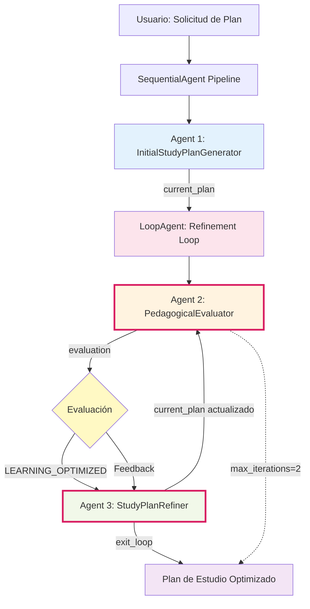

# Evaluator-Optimizer Agent - Generador de Planes de Estudio Personalizados

## 📋 Descripción Funcional

Sistema multi-agente que genera planes de estudio personalizados mediante un ciclo iterativo de evaluación y refinamiento. A diferencia de pipelines lineales, este sistema implementa un **feedback loop** donde un agente evaluador critica el plan generado y un agente refinador lo mejora hasta cumplir estándares pedagógicos rigurosos.

**Ciclo de mejora continua:**
1. **Generación** → Crea plan inicial basado en investigación (Google Search)
2. **Evaluación** → Analiza el plan con 8 criterios pedagógicos
3. **Refinamiento** → Mejora el plan según feedback O sale del loop si está optimizado
4. **Repetir** → Regresa a evaluación (máximo 2 iteraciones)

**Ventajas del patrón evaluator-optimizer:**
- 🔄 **Calidad iterativa:** El plan se refina progresivamente
- 🎯 **Criterios objetivos:** Evaluación basada en estándares pedagógicos
- 🛡️ **Salvaguardas:** `max_iterations` previene loops infinitos
- ✅ **Condición de salida clara:** "LEARNING_OPTIMIZED" termina el ciclo

**Casos de uso:**
- Generación de planes de estudio personalizados
- Diseño instruccional automatizado
- Sistemas que requieren validación antes de output final
- Cualquier tarea que se beneficie de revisión y refinamiento

## 🏗️ Arquitectura del Sistema



> **Nota sobre el loop:** Los agentes E y G forman un ciclo que se repite hasta que la evaluación retorna "LEARNING_OPTIMIZED" o se alcanza `max_iterations=2`. La variable `current_plan` se sobrescribe en cada iteración del refinador.

### Componentes del Pipeline

#### 🔵 Fase 1: Generación Inicial

##### 1️⃣ Initial Study Plan Generator Agent
- **Función:** Crea plan de estudio inicial basado en requisitos del usuario
- **Herramienta:** Google Search
- **Investiga:**
  - Recursos educativos actualizados sobre el tema
  - Secuencia típica de aprendizaje
  - Pre-requisitos necesarios
  - Proyectos prácticos recomendados
- **Input del usuario:**
  - Tema a aprender
  - Nivel actual de conocimiento
  - Tiempo disponible (horas/semana)
  - Duración deseada del plan
  - Objetivo final específico
- **Salida (`current_plan`):** Plan estructurado con fases, objetivos, contenidos, recursos, prácticas y proyecto integrador

#### 🔴 Fase 2: Loop de Refinamiento (max 2 iteraciones)

##### 2️⃣ Pedagogical Evaluator Agent
- **Función:** Evalúa el plan según criterios de diseño instruccional
- **Entrada:** `{current_plan}`
- **Criterios de evaluación (8 dimensiones):**
  1. ✅ Pre-requisitos claramente identificados y realistas
  2. ✅ Secuenciación lógica sin saltos abruptos
  3. ✅ Carga cognitiva manejable
  4. ✅ Balance teoría/práctica adecuado
  5. ✅ Recursos específicos, accesibles y actualizados
  6. ✅ Hitos claros de evaluación formativa
  7. ✅ Viabilidad temporal realista
  8. ✅ Proyecto integrador apropiado al nivel
- **Salida (`evaluation`):**
  - `"LEARNING_OPTIMIZED"` si cumple TODOS los criterios
  - Feedback estructurado con 3-4 problemas críticos si hay deficiencias

##### 3️⃣ Study Plan Refiner Agent
- **Función:** Refina el plan basándose en feedback o finaliza el loop
- **Herramienta:** `FunctionTool(exit_loop)` - función que termina el ciclo
- **Entrada:** `{current_plan}` + `{evaluation}`
- **Lógica condicional:**
  - **Si evaluación == "LEARNING_OPTIMIZED":**
    - Llama `exit_loop()` → termina el loop
  - **Si evaluación contiene feedback:**
    - Reescribe el plan incorporando TODAS las sugerencias
    - Mantiene estructura pero mejora contenido
    - Preserva elementos que estaban bien
- **Salida:** `current_plan` actualizado (sobrescribe el anterior)

#### 🛡️ Salvaguarda: max_iterations=2

Si después de 2 iteraciones el evaluador sigue encontrando problemas, el loop se detiene automáticamente para evitar ejecución infinita. En producción, este valor podría ajustarse según necesidades.

## 🧪 Prompts de Prueba

### Prompt 1: Machine Learning desde cero
```
Quiero aprender Machine Learning desde cero.

Nivel actual: Sé programar en Python (nivel intermedio), conozco matemáticas básicas pero no cálculo avanzado ni álgebra lineal.

Tiempo disponible: 10 horas por semana

Duración deseada: 4 meses

Objetivo final: Poder crear y entrenar modelos de clasificación y regresión, y entender cuándo usar cada algoritmo. Quiero aplicarlo en proyectos de análisis de datos.
```

---

### Prompt 2: Desarrollo Web Full Stack (rápido)
```
Necesito aprender desarrollo web full stack lo más rápido posible.

Nivel actual: Conozco HTML/CSS básico, nunca he programado en JavaScript ni backend.

Tiempo disponible: 20 horas por semana (estoy desempleado y puedo dedicarle tiempo completo)

Duración deseada: 8 semanas

Objetivo final: Poder construir y deployar una aplicación web completa (tipo to-do list o blog) con autenticación de usuarios y base de datos. Busco conseguir trabajo de junior developer.
```

---

## 🔄 Patrón Evaluator-Optimizer Loop

### Cuándo usar este patrón

**✅ Ideal para:**
- Generación de contenido que requiere calidad garantizada
- Sistemas donde el output debe cumplir criterios específicos
- Tareas que se benefician de revisión iterativa
- Casos donde hay estándares de evaluación claros

**❌ NO usar para:**
- Tareas simples sin necesidad de refinamiento
- Cuando la evaluación es subjetiva sin criterios claros
- Procesos donde cada iteración es costosa (tiempo/dinero)
- Casos donde el primer intento es suficiente

### Comparación de Patrones

| Aspecto | LoopAgent (Evaluator-Optimizer) | SequentialAgent | ParallelAgent |
|---------|--------------------------------|-----------------|---------------|
| **Flujo** | Cíclico con condición de salida | Lineal A→B→C | Simultáneo A+B+C |
| **Iteraciones** | Múltiples (hasta max_iterations) | 1 vez | 1 vez |
| **Dependencias** | Output se retroalimenta | Cada agente depende del anterior | Agentes independientes |
| **Garantía de calidad** | Alta (validación iterativa) | Media | Media |
| **Costo computacional** | Alto (múltiples pasadas) | Medio | Medio |
| **Mejor para** | Refinamiento hasta criterios | Pipeline lineal de transformaciones | Investigación paralela |

### Componentes Clave del Patrón

#### 1. Condición de Salida Clara
```python
# El evaluador retorna exactamente "LEARNING_OPTIMIZED"
# El refiner detecta esta string y llama exit_loop()
```

**Importante:** La condición debe ser inequívoca y verificable.

#### 2. Función de Salida del Loop
```python
def exit_loop():
    """Termina el loop cuando se alcanza el estado óptimo"""
    return {"status": "optimized", "message": "..."}
```

Herramienta especial (`FunctionTool`) que el agente refiner puede llamar.

#### 3. Variable que se Sobrescribe
```python
output_key="current_plan"  # Se actualiza en cada iteración
```

La misma variable se lee, evalúa, modifica y vuelve a evaluar.

#### 4. Límite de Iteraciones
```python
max_iterations=2  # Salvaguarda contra loops infinitos
```

**Recomendaciones:**
- Desarrollo/testing: 2-3 iteraciones
- Producción: 3-5 iteraciones según complejidad
- Monitorear cuántas iteraciones se usan realmente

### Errores Comunes a Evitar

❌ **Condición de salida ambigua**
- Malo: "El plan está bien" (subjetivo)
- Bueno: "LEARNING_OPTIMIZED" (string exacta)

❌ **No definir max_iterations**
- Siempre incluir salvaguarda

❌ **Evaluador que modifica**
- Evaluator solo critica, Refiner modifica
- Separación de responsabilidades clara

❌ **Olvida manejar ambos casos en el Refiner**
- Debe tener lógica para "optimizado" Y "feedback"

## 💡 Notas de Implementación

**Gestión del output_key:**
- `current_plan` es creado por Generator
- Leído por Evaluator (no lo modifica)
- Sobrescrito por Refiner (mismo key)
- El loop mantiene la versión más reciente

**Herramienta exit_loop:**
- Solo el Refiner tiene acceso a `FunctionTool(exit_loop)`
- El Evaluator NO puede terminar el loop directamente
- Separa responsabilidad: Evaluator decide SI salir, Refiner ejecuta la salida

**Optimización de Google Search:**
- Solo Generator usa Google Search (no los agentes en el loop)
- Reduce costos y tiempo al no buscar en cada iteración
- El Refiner mejora basándose en conocimiento del LLM + feedback
