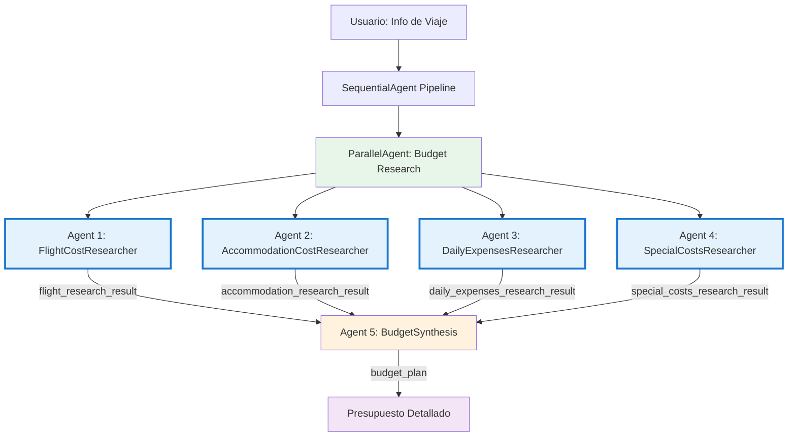

# Parallel Agent - Sistema de Planificación de Presupuestos de Viaje

## 📋 Descripción Funcional

Sistema multi-agente que genera presupuestos detallados de viaje mediante investigación paralela. Ejecuta simultáneamente 4 agentes especializados que investigan diferentes aspectos del presupuesto (vuelos, alojamiento, gastos diarios, costos especiales) y luego sintetiza la información en un plan financiero completo y accionable.

**Ventaja de ejecución paralela:**
- ⚡ **Velocidad:** 4 investigaciones simultáneas vs 4 secuenciales
- 🎯 **Especialización:** Cada agente enfocado en un dominio específico con prompts optimizados
- 🔄 **Eficiencia:** Todas las búsquedas en Google ocurren al mismo tiempo

**Flujo de procesamiento:**
1. **Investigación Paralela** → 4 agentes buscan información simultáneamente usando Google Search
2. **Síntesis** → Un agente combina resultados en presupuesto estructurado con recomendaciones personalizadas

**Casos de uso:**
- Planificación financiera de viajes internacionales
- Evaluación de viabilidad de presupuesto disponible
- Comparación de opciones y rangos de costos
- Identificación de costos ocultos y recomendaciones de optimización

## 🏗️ Arquitectura del Sistema



> **Nota sobre paralelismo:** Los agentes se ejecutan simultáneamente (no secuencialmente), lo que reduce dramáticamente el tiempo total de investigación. Los resultados se pasan al agente de síntesis mediante `output_key`.

### Componentes del Pipeline

#### 🔵 Fase 1: Parallel Agent (Investigación Simultánea)

##### 1️⃣ Flight Cost Researcher Agent
- **Función:** Investiga costos y opciones de vuelos internacionales
- **Herramienta:** Google Search
- **Investiga:**
  - Rango de precios para fechas específicas
  - Aerolíneas que operan la ruta
  - Disponibilidad de vuelos directos vs escalas
  - Mejor momento para comprar
  - Aeropuertos alternativos
- **Salida (`flight_research_result`):** Resumen conciso con rangos de precio y opciones

##### 2️⃣ Accommodation Cost Researcher Agent
- **Función:** Investiga costos y opciones de alojamiento
- **Herramienta:** Google Search
- **Investiga:**
  - Precio promedio por noche (hoteles 3-4 estrellas, Airbnb, hostales)
  - Zonas recomendadas (balance costo-ubicación)
  - Diferencia de precio entre zonas céntricas vs periféricas
  - Opciones de descuento
- **Salida (`accommodation_research_result`):** Resumen con rangos por noche y recomendación de zona

##### 3️⃣ Daily Expenses Researcher Agent
- **Función:** Investiga costos diarios de comida, transporte y actividades
- **Herramienta:** Google Search
- **Investiga:**
  - Costo promedio de comidas (desayuno, almuerzo, cena)
  - Precio de transporte público local
  - Costo de entradas a atracciones principales
  - Presupuesto sugerido por día según estilo
  - Tips de ahorro
- **Salida (`daily_expenses_research_result`):** Resumen con presupuesto diario y tips

##### 4️⃣ Special Costs Researcher Agent
- **Función:** Investiga requisitos especiales y costos ocultos
- **Herramienta:** Google Search
- **Investiga:**
  - Visa requirements y costos
  - Seguro de viaje recomendado
  - SIM card local vs roaming
  - Pases turísticos (Japan Rail Pass, city passes)
  - Propinas y cultura de pagos
  - Costos ocultos comunes
- **Salida (`special_costs_research_result`):** Resumen destacando gastos a no olvidar

#### 🟠 Fase 2: Sequential Agent (Síntesis)

##### 5️⃣ Budget Synthesis Agent
- **Función:** Sintetiza toda la investigación en presupuesto detallado
- **Entrada:** Resultados de los 4 agentes investigadores
- **Genera:**
  - 📋 Resumen ejecutivo con viabilidad del presupuesto
  - 🎫 Desglose detallado de costos por categoría
  - 📊 Presupuesto total (mínimo-máximo)
  - 💡 Recomendaciones personalizadas según presupuesto del usuario
  - 🎯 Distribución sugerida por porcentajes
  - ⚠️ Alertas sobre ajustes necesarios

## 🧪 Prompts de Prueba

### Prompt 1: Viaje a Japón
```
Quiero viajar a Japón del 5 al 15 de abril (10 días).
Salgo desde Ciudad de México.
Presupuesto total: $3500 USD (SIN incluir vuelos internacionales).
Intereses: cultura tradicional, gastronomía local, templos.
Estilo: viajero medio (no backpacker extremo, pero tampoco lujo).
```

---

### Prompt 2: Viaje a Europa con presupuesto ajustado
```
Planeo viajar a España (Barcelona y Madrid) en julio por 12 días.
Vuelo desde Bogotá, Colombia.
Presupuesto TOTAL: $2000 USD (incluyendo TODO).
Voy con mi pareja, nos interesa arte, arquitectura y vida nocturna moderada.
¿Es realista este presupuesto?
```

---

### Prompt 3: Viaje familiar a Disney
```
Familia de 3 personas (2 adultos, 1 niño de 5 años).
Orlando, Florida - 7 días en diciembre.
Salimos desde Cali, Colombia.
Presupuesto: $5000 USD total.
Queremos ir a Magic Kingdom y Universal Studios.
¿Nos alcanza? ¿Qué debemos priorizar?
```

---

## ⚡ Ventajas del Patrón Paralelo

**Comparación: Parallel vs Sequential**

| Aspecto | ParallelAgent | SequentialAgent |
|---------|---------------|-----------------|
| **Tiempo de ejecución** | ~T (tiempo de 1 búsqueda) | ~4T (4 búsquedas secuenciales) |
| **Dependencias entre agentes** | No hay (investigaciones independientes) | Sí (cada agente depende del anterior) |
| **Mejor para** | Tareas independientes que pueden ejecutarse simultáneamente | Tareas donde output de uno es input del siguiente |
| **Complejidad** | Media (sincronización de resultados) | Baja (flujo lineal) |

**Cuándo usar ParallelAgent:**
- ✅ Múltiples fuentes de datos independientes
- ✅ Investigaciones que no dependen entre sí
- ✅ Optimización de tiempo es crítica
- ✅ Cada sub-tarea tiene dominio bien definido

**Cuándo NO usar ParallelAgent:**
- ❌ Las tareas dependen de resultados anteriores
- ❌ Hay restricciones de rate limiting en APIs/servicios
- ❌ El orden de procesamiento es importante para la lógica

## 💡 Notas de Implementación

**Gestión de output_key:**
- Cada agente paralelo debe tener un `output_key` único
- El agente de síntesis accede a estos outputs mediante placeholders: `{flight_research_result}`
- No se requiere almacenamiento externo; los datos fluyen en memoria entre agentes

**Consideraciones de Google Search:**
- Los 4 agentes usan `google_search` simultáneamente
- Cada búsqueda es independiente y específica a su dominio
- El patrón paralelo maximiza eficiencia al realizar búsquedas concurrentes
