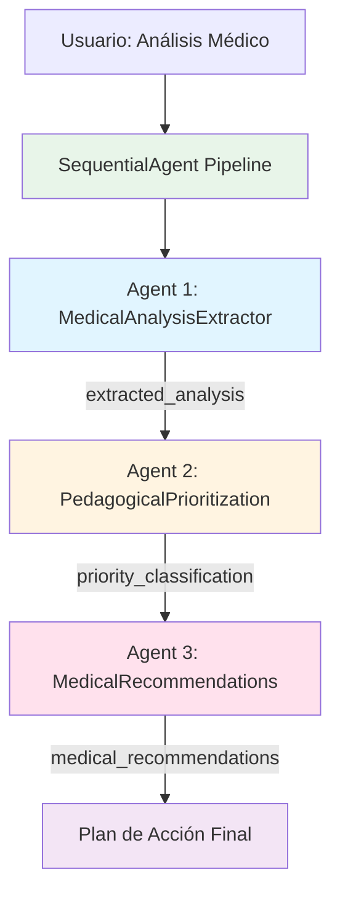

# Sequential Agent - Pipeline de Revisión de Análisis Médicos

## 📋 Descripción Funcional

Sistema multi-agente diseñado para analizar resultados de análisis clínicos y generar recomendaciones médicas estructuradas. El pipeline ejecuta tres agentes especializados en secuencia, donde cada uno procesa los resultados del anterior para generar insights progresivamente más refinados.

**Flujo de procesamiento:**
1. **Extracción** → Identifica y estructura datos clave del análisis médico
2. **Priorización** → Clasifica hallazgos según urgencia clínica (Alta/Media/Baja)
3. **Recomendaciones** → Genera plan de acción personalizado basado en las prioridades

**Casos de uso:**
- Triaje automatizado de resultados de laboratorio
- Orientación preliminar para pacientes sobre próximos pasos
- Soporte a decisiones clínicas para profesionales de salud
- Educación médica sobre interpretación de análisis

## 🏗️ Arquitectura del Sistema



> **Nota:** Los datos fluyen secuencialmente entre agentes a través de claves de salida (`output_key`). Cada agente procesa la información del anterior sin necesidad de almacenamiento externo.

### Componentes del Pipeline

#### 1️⃣ Medical Analysis Extractor Agent
- **Función:** Extrae información estructurada del texto del análisis médico
- **Salida (`extracted_analysis`):**
  - Tipo de análisis (hemograma, perfil lipídico, etc.)
  - Valores reportados con unidades
  - Valores fuera de rango
  - Datos demográficos del paciente
  - Fecha del análisis

#### 2️⃣ Medical Prioritization Agent
- **Función:** Clasifica hallazgos según criterios de triaje clínico
- **Entrada:** `{extracted_analysis}`
- **Salida (`priority_classification`):**
  - 🔴 **Prioridad ALTA:** Valores críticos, riesgo inmediato
  - 🟡 **Prioridad MEDIA:** Alteraciones que requieren seguimiento próximo
  - 🟢 **Prioridad BAJA:** Desviaciones menores, monitoreo rutinario

#### 3️⃣ Medical Recommendations Agent
- **Función:** Genera plan de acción basado en priorización
- **Entrada:** `{extracted_analysis}` + `{priority_classification}`
- **Salida (`medical_recommendations`):**
  - Acciones inmediatas (24-48h)
  - Seguimiento recomendado (citas, especialistas)
  - Cambios en estilo de vida
  - Resumen ejecutivo con nivel de urgencia

## 🧪 Prompts de Prueba

### Prompt 1: Caso de Hemograma con Anemia
```
Analiza el siguiente resultado de hemograma:

Paciente: Mujer, 45 años
Fecha: 08/02/2026

HEMOGRAMA COMPLETO:
- Hemoglobina: 9.2 g/dL (Valor de referencia: 12.0-16.0)
- Hematocrito: 28% (Valor de referencia: 36-46%)
- Glóbulos rojos: 3.8 millones/μL (Valor de referencia: 4.0-5.5)
- VCM: 74 fL (Valor de referencia: 80-100)
- HCM: 24 pg (Valor de referencia: 27-32)
- Glóbulos blancos: 7,200/μL (Normal)
- Plaquetas: 245,000/μL (Normal)
```

---

### Prompt 2: Caso de Perfil Lipídico Alterado
```
Revisa estos resultados de perfil lipídico:

Paciente: Hombre, 52 años, sin medicación actual
Fecha: 09/02/2026

PERFIL LIPÍDICO:
- Colesterol Total: 285 mg/dL (Deseable: <200)
- LDL Colesterol: 190 mg/dL (Óptimo: <100)
- HDL Colesterol: 35 mg/dL (Deseable: >40)
- Triglicéridos: 320 mg/dL (Normal: <150)
- Glucosa en ayunas: 118 mg/dL (Normal: 70-100)
```

---

### Prompt 3: Caso de Función Tiroidea Limítrofe
```
Evalúa este análisis de función tiroidea:

Paciente: Mujer, 38 años, refiere cansancio crónico
Fecha: 09/02/2026

PERFIL TIROIDEO:
- TSH: 8.5 μUI/mL (Rango normal: 0.4-4.0)
- T4 Libre: 0.9 ng/dL (Rango normal: 0.8-1.8)
- T3 Libre: 2.8 pg/mL (Rango normal: 2.3-4.2)
- Anticuerpos Anti-TPO: 125 UI/mL (Normal: <35)
```

---

## ⚠️ Disclaimer

Este sistema genera análisis preliminares con **fines educativos y de orientación**. 

**NO sustituye:**
- Diagnóstico médico profesional
- Consulta presencial con especialistas
- Tratamiento médico personalizado

Todos los outputs incluyen un disclaimer obligatorio recordando al usuario consultar con su médico tratante.
