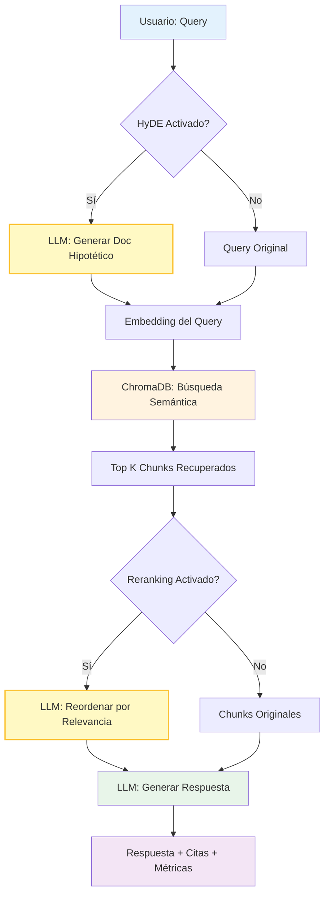

# 🔍 Tech Docs Explorer

Aplicación RAG (Retrieval-Augmented Generation) educativa para explorar y consultar documentación técnica mediante chat conversacional potenciado por búsqueda semántica.

## 📋 Descripción Funcional

Sistema completo de RAG que permite indexar documentación técnica (URLs y PDFs) y consultarla mediante chat interactivo. Implementa técnicas avanzadas como HyDE (Hypothetical Document Embeddings) para transformación de queries y LLM reranking para mejorar la relevancia de resultados.

**Flujo de procesamiento:**
1. **Indexación** → Carga y procesa documentos en chunks
2. **Embedding** → Genera representaciones vectoriales (OpenAI)
3. **Almacenamiento** → Persiste en ChromaDB (base de datos vectorial)
4. **Query** → Usuario consulta en lenguaje natural
5. **Retrieval** → Búsqueda semántica con HyDE opcional
6. **Reranking** → Reordena resultados con LLM
7. **Generación** → LLM sintetiza respuesta con citas

**Características principales:**
- 📥 Indexación multi-fuente (URLs y PDFs)
- 💬 Chat RAG con parámetros configurables en tiempo real
- 🔮 HyDE para mejorar queries ambiguas
- 📊 LLM Reranking de resultados
- 💰 Tracking de costos en tiempo real con tokens reales de OpenAI
- 📈 Métricas y evaluación con RAGAS
- 📂 ChromaDB Explorer para inspección de embeddings
- ⚙️ Configuración en dos niveles (.env + config.yaml)

## 🏗️ Arquitectura RAG



> **Nota:** HyDE y Reranking son opcionales y configurables por el usuario en tiempo real desde la interfaz.

## Requisitos Previos

- Python 3.12+
- `uv` (gestor de paquetes Python moderno)
- OpenAI API Key

## Configuración

### 1. Instalar dependencias

```bash
uv sync
```

Esto instalará automáticamente todas las dependencias definidas en `pyproject.toml`.

### 2. Configurar variables de entorno

```bash
cp .env.example .env
```

Edita `.env` con tu clave de OpenAI:

```env
OPENAI_API_KEY=sk-tu-api-key-aqui
CHROMA_PERSIST_DIR=./data/chroma  # Opcional
```

### 3. Ajustar configuración de aplicación (opcional)

El archivo `config/config.yaml` permite ajustar:
- Modelos LLM (embedding: `text-embedding-3-small`, chat: `gpt-4o-mini`)
- Precios de OpenAI por 1M tokens (para cálculo de costos)
- Parámetros de retrieval (top_k, similarity_threshold)
- Activación por defecto de HyDE y reranking
- Tamaños de chunks y overlap

## Ejecución

Ejecutar la aplicación Streamlit:

```bash
uv run streamlit run main.py
```

La aplicación estará disponible en [http://localhost:8501](http://localhost:8501).

## Uso de la Interfaz

La aplicación tiene 3 pestañas principales:

**1. 📥 Indexing** - Indexa URLs o PDFs de documentación técnica. Muestra costo estimado basado en tokens de embeddings.

**2. 💬 Chat** - Consulta la documentación con parámetros configurables (top_k, similarity, HyDE, reranking). Cada respuesta incluye costo real en USD.

**3. 📂 Explorer** - Navega colecciones de ChromaDB e inspecciona chunks/embeddings

> **💡 Sidebar:** Tabla de precios de OpenAI por 1M tokens para referencia educativa.

## Estructura del Código

```
tech-docs-explorer/
├── config/              # Sistema de configuración
├── core/
│   ├── helpers/        # Utilidades (pricing, etc.)
│   ├── indexing/       # Pipeline de indexación y HyDE
│   ├── loaders/        # Cargadores (Web, PDF)
│   ├── retrieval/      # Motor RAG y reranking
│   └── storage/        # Cliente ChromaDB
├── llm/                # Providers LLM (OpenAI)
├── ui/                 # Interfaz Streamlit
│   └── tabs/           # Componentes por pestaña
├── data/               # Datos persistentes
│   └── chroma/         # Base de datos vectorial
└── main.py             # Entry point
```

## Recursos Adicionales

- [LlamaIndex Documentation](https://docs.llamaindex.ai/) - Framework RAG utilizado
- [ChromaDB Documentation](https://docs.trychroma.com/) - Base de datos vectorial
